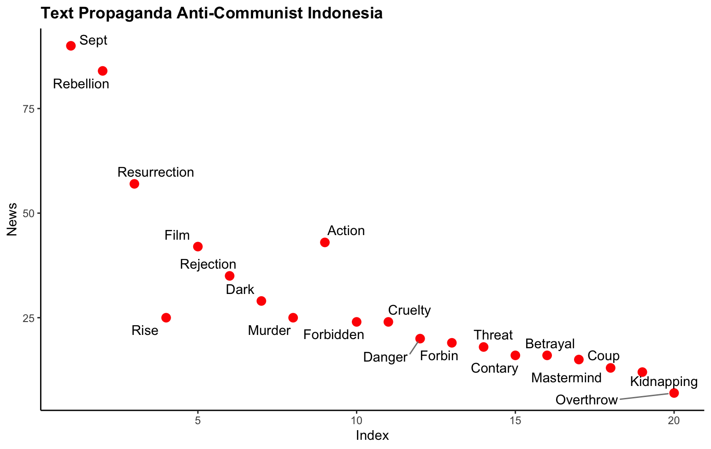
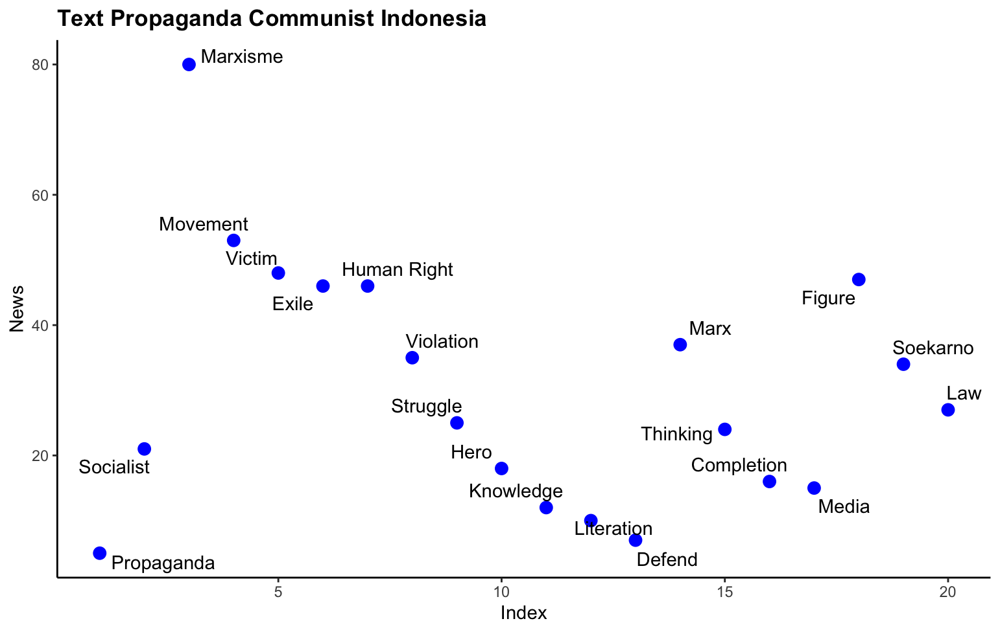

# [Mass Media Propaganda: Indonesian Communism & Anti-Communism in the Mass Media](https://hrcak.srce.hr/en/file/469510) 

This amateur project presents the results of my personal research data analysis using a combination of NVivo and R-Studio that has been published.

#### Source Research 🔎:
Analyzing mass media propaganda of communism and anti-communism in Indonesia.

#### Method 🛠️:
260 news items were collected, then processed using NVivo Pro software such as automatic coding. After that, creating data visuals using R Studio.

#### Analysis Data 📈:
Time-Line and Word Frequency.

## Time - Line Analysis
From all the news, I reconstructed the time sequence of events in news events in monthly measurements.

### Data Frame and Visual Time Line Framing Media of Communist Propaganda Indonesia
```r
date_data <-data.frame(Month=c('Jan','Feb','Mar','Apr','May',
                               'Jun','Jul','Aug','Sep','Oct',
                               'Nov','Dec'),
                        Propaganda=c(12,6,13,7,24,24,17,18,90,36,7,6)) #result coding in NVivo Pro

ggplot(data = date_data, aes(x=Month, y=Propaganda, group=1))+
  geom_line(col="red")+
  geom_point()+
labs(title = "Timeline Framing Media of Communist propaganda in Indonesia",
     x = "Month",
     y = "Propaganda News") +
  theme_bw() +
  theme(plot.title = element_text(face = "bold")) 

```


The result is that the case of propaganda of the issue of communism in Indonesia is always highlighted in September, one of the strong factors is on September 30, 1965 which was the rebellion between the Indonesian Communist Party and the Indonesian military. So that the issue of history is always highlighted until now. 
After that we see two perspectives of propaganda in the media by Pro – Communism and Anti – Communism;

### Data Frame and Visual Anti Communist Propaganda Indonesia

```r
date_againts <-data.frame(Month=c('Jan','Feb','Mar','Apr','May',
                                     'Jun','Jul','Aug','Sep','Oct',
                                     'Nov','Dec'),
                        Against=c(2,0,12,7,8,6,8,10,99,14,0,0)) #result coding in NVivo Pro
# Basic Line
ggplot(data = date_againts, aes(x=Month, y=Against, group=1)) +
  geom_line(col = 'red')+
  geom_point()+
  labs(title = "Time Line Framing Media of Anti Communist Propaganda in Indonesia",
       x = "Month",
       y = "News") +
  theme_bw() +
theme(plot.title = element_text(face = "bold")) 

```


Of the 260 news items, it should be noted that anti-communist propaganda is very dominant, the red timeline identifies anti-communist propaganda in Indonesia which tends to be reported every September, followed by October and August. After this, after this, we would see propaganda communist timeline.

### Data Frame and Visual Comunist Propaganda Indonesia

```r
date_pro <-data.frame(Month=c('Jan','Feb','Mar','Apr','May',
                              'Jun','Jul','Aug','Sep','Oct',
                              'Nov','Dec'),
                      NPro=c(3,2,0,0,0,0,3,10,16,20,0,45))  #result coding in NVivo Pro
# Basic Line
ggplot(data = date_pro, aes(x=Month, y=NPro, group=1)) +
  geom_line(col= 'blue')+
  geom_point()+
  labs(title = "Time Line Framing Media of Communist Propaganda in Indonesia",
       x = "Month",
       y = "News") +
  theme_bw() +
  theme(plot.title = element_text(face = "bold"))  

```

Communism propaganda in the blue timeline image on the right, the majority of the propaganda of which is also reported in the same months such as September, October and December, on the timeline of these months does not have a day that must be commemorated as a moment for a theme

## Analysis Text Propaganda 
This text analysis is to identify words (key words) that are often used in propaganda. I captured my text data through NVivo to see the size of its frequency.

### Data Frame and Visual Text Propaganda Anti Communist Indonesia
```r
library(ggplot2)
#Create dataset 
x1 <-c(1,2,3,4,5,6,7,8,9,10,
       11,12,13,14,15,16,17,18,19,20)
y1 <-c(90,84,57,25,42,35,29,25,43,24,24,20,19,18,16,16,15,13,12,7)
label1<-c('Sept','Rebellion','Resurrection','Rise','Film',
          'Rejection','Dark','Murder','Action','Forbidden',
          'Cruelty','Danger','Forbin','Threat','Contary',
          'Betrayal','Coup','Mastermind','Kidnapping','Overthrow')

againts.data <-data.frame(x1, y1, label1)

library(ggplot2)
library(ggrepel)
ggplot(data = againts.data, aes(x=x1, y=y1))+
  geom_point(color ="red", size =3)+
  labs(title = "Text Propaganda Anti-Communist Indonesia",
       x = "Index",
       y = "News") +
geom_text_repel(aes(label= label1),
        box.padding = 0.35,
        point.padding = 0.5,
        segment.color = 'grey50') +
  theme_classic() +
  theme(plot.title = element_text(face = "bold")) 

```


The four most dominant keywords are "Sept" which refers to propaganda that presents the events of September 30, 1965 from a biased or tendentious perspective. Furthermore, the keyword "Rebellion" shows that there are 10 keywords in the news titles that are spread through several cases of communist rebellion in Madiun Regency and the G30S PKI rebellion. The next keyword is the propaganda "Resurrection" which is often narrated by a number of national figures and community organizations that communism in Indonesia will rise again.

### Data Frame and Visual Text Propaganda Communist Indonesia

```r
library(ggplot2)
#create dataset 
x2 <-c(1,2,3,4,5,6,7,8,9,10,
       11,12,13,14,15,16,17,18,19,20)
y2 <-c(5,21,80,53,48,46,46,35,25,18,12,10,7,37,24,16,15,47,34,27)
label2 <-c('Propaganda','Socialist','Marxisme','Movement','Victim',
          'Exile','Human Right','Violation','Struggle','Hero',
          'Knowledge','Literation','Defend','Marx','Thinking',
          'Completion','Media','Figure','Soekarno','Law')

data.pro <-data.frame(x2, y2, label2)
library(ggplot2)
library(ggrepel)
ggplot(data = data.pro, aes(x=x2, y=y2))+
  geom_point(color='blue', size=3)+
  labs(title = "Text Propaganda Communist Indonesia",
       x = "Index",
       y = "News") +
  geom_text_repel(aes(label=label2),
                  box.padding = 0.35,
                  point.padding = 0.5,
                  segment.color = 'grey50')+
  theme_classic() +
  theme(plot.title = element_text(face = "bold")) 

```

the first is "Marxism" and "Movement", the other three propaganda keywords such as "Victim" this propaganda brings counter propaganda to the post 1966 New Order government which massacred the communism movement, after there is the keyword "Exile" which is related to the keyword "Human Rights", news that raises the issue of victims of political prisoners and victims of political exile through direct victims, some news also reports on human rights handling services for victims of political exile through the government directly.

