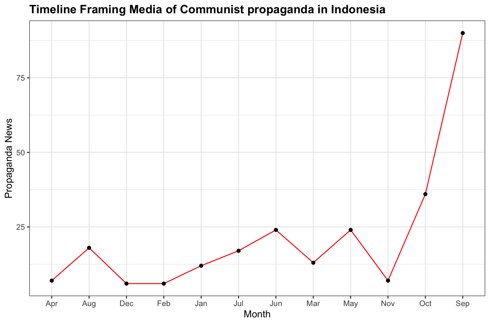

# [Mass Media Propaganda: Indonesian Communism & Anti-Communism in the Mass Media](https://hrcak.srce.hr/en/file/469510)

This amateur project presents the results of my personal research data analysis using a combination of NVivo and R-Studio that has been published.

#### Source Research 🔎:
Analyzing mass media propaganda of communism and anti-communism in Indonesia.

#### Method 🛠️:
260 news items were collected, then processed using NVivo Pro software such as automatic coding. After that, creating data visuals using R Studio.

#### Analysis Data 📈:
Strip Plot, Scatter Plot, Time-Line and Word Frequency.

## Time - Line Analysis
From all the news, I reconstructed the time sequence of events in news events in monthly measurements.

### Data Frame and Visual 
```r
date_data <-data.frame(Month=c('Jan','Feb','Mar','Apr','May',
                               'Jun','Jul','Aug','Sep','Oct',
                               'Nov','Dec'),
                        Propaganda=c(12,6,13,7,24,24,17,18,90,36,7,6))

ggplot(data = date_data, aes(x=Month, y=Propaganda, group=1))+
  geom_line(col="red")+
  geom_point()+
labs(title = "Timeline Framing Media of Communist propaganda in Indonesia",
     x = "Month",
     y = "Propaganda News") +
  theme_bw() +
  theme(plot.title = element_text(face = "bold")) 

```

